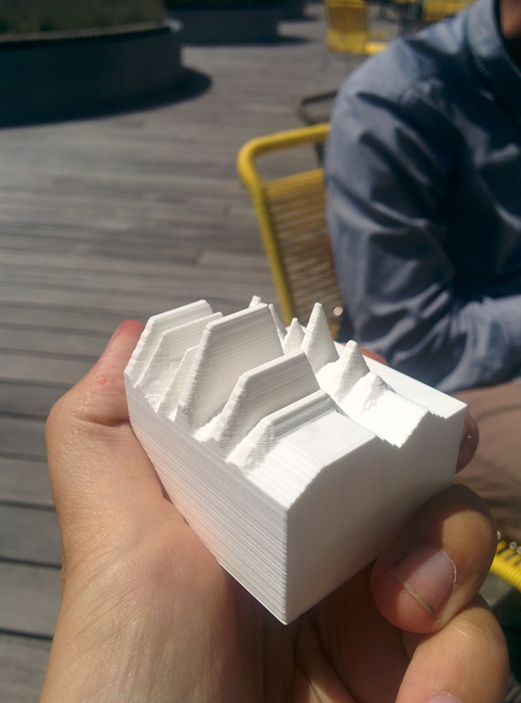
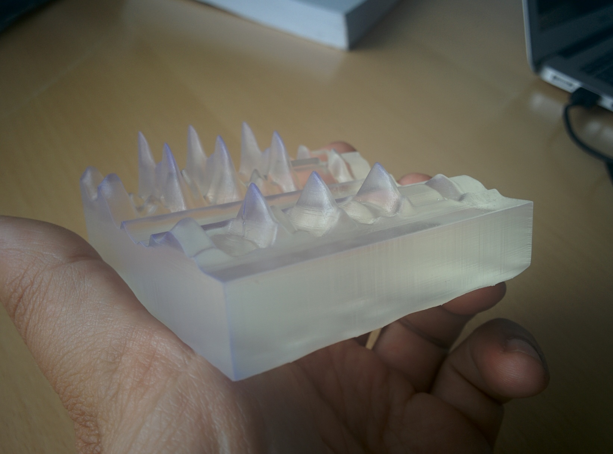

# Make a Data Object

This is a sociomaterial assemblage (eyeroll) to make 3D printed presents for visitors of the [Technologies in Practice research group](https://tip.itu.dk) at [IT University of Copenhagen](https://itu.dk).

There's a class `AdditiveDataObject`, instantiate it. Web interface asks all the necessary questions.

